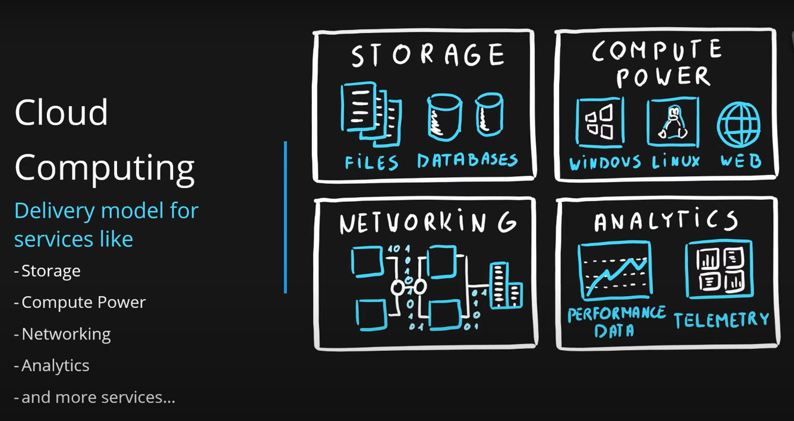
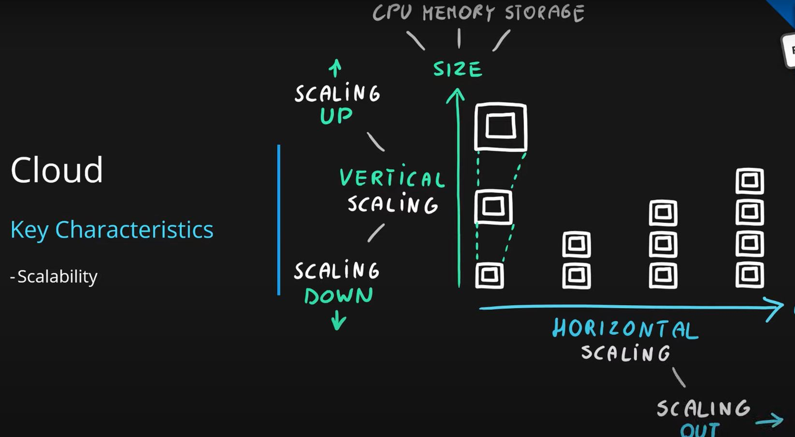
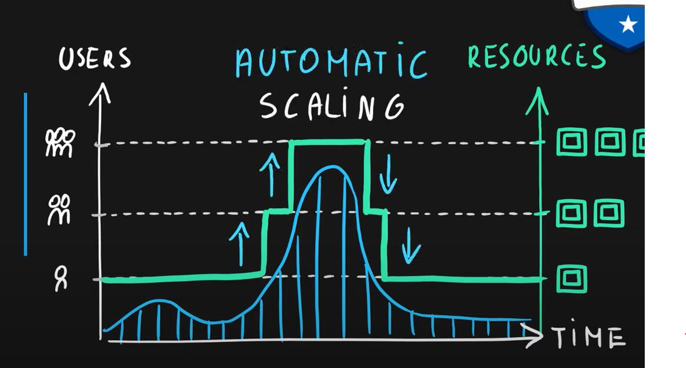
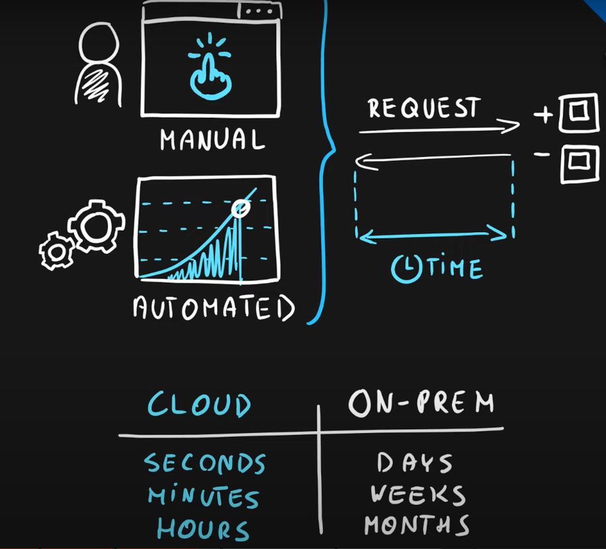
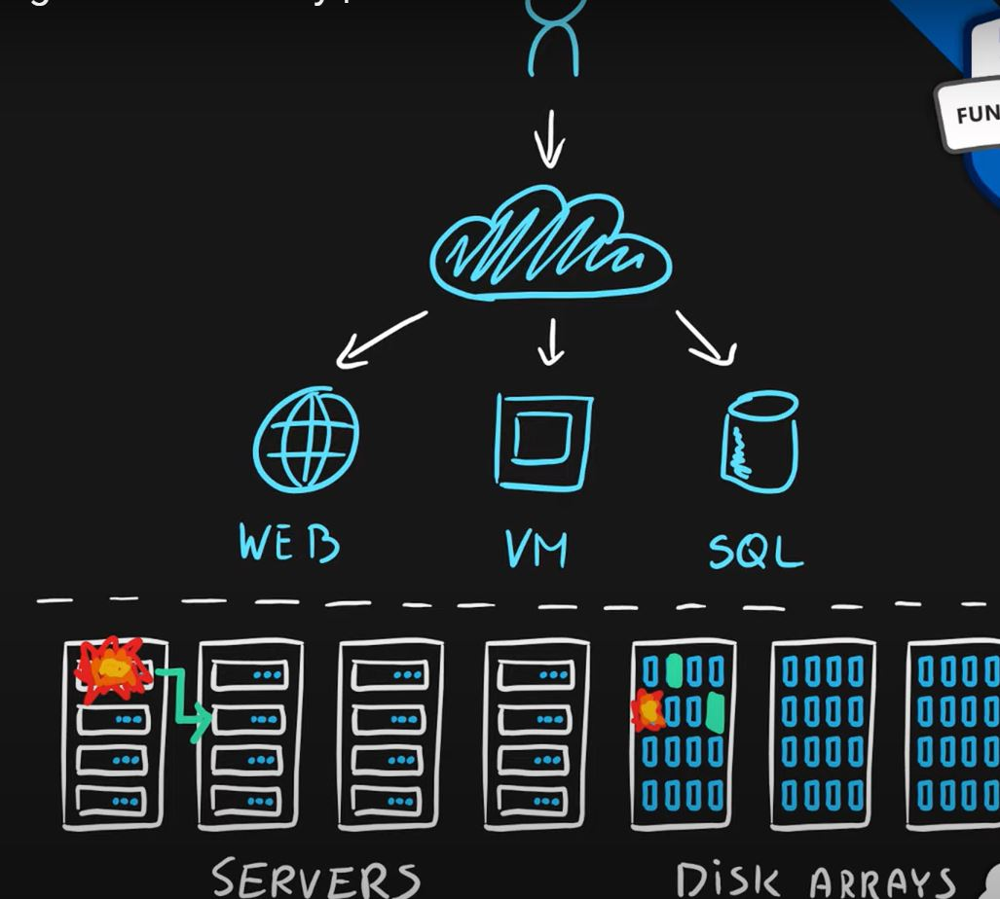
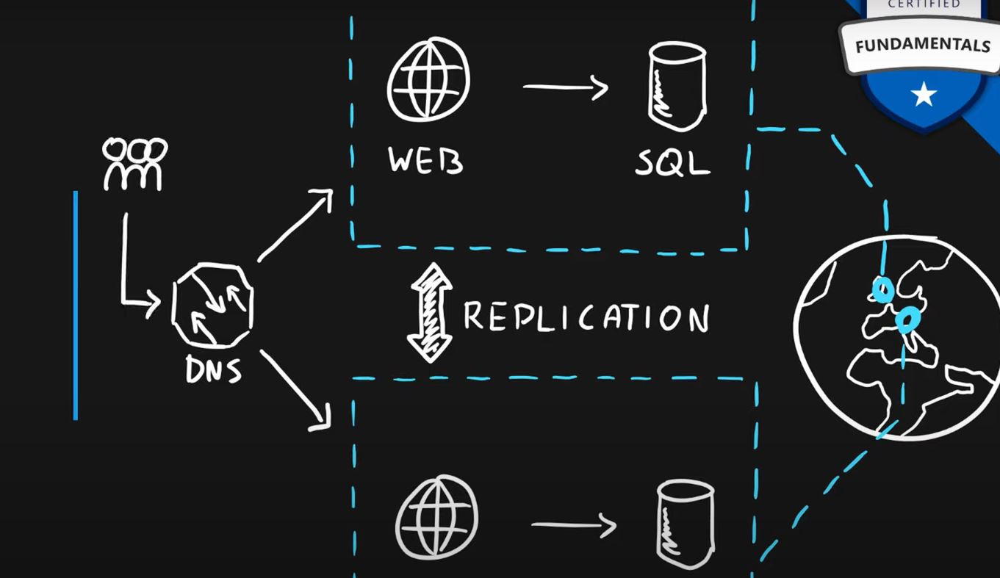
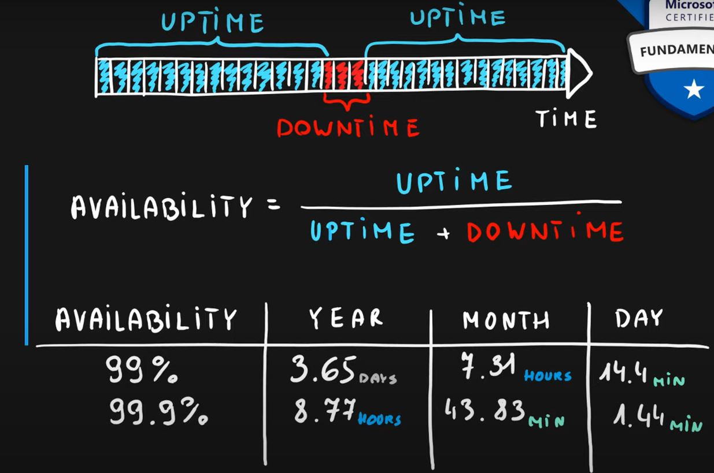

# AZ-900 by Adam Marczac

## 1. Cloud Computing
<pre>
Service delivery model over the internet (cloud). This includes but is not limited to compute power meaning servers such as windows, linux, hosting environments, etc. storage like files and/or databases networking in azure but also outside when connecting to your company network
analytics services for visualization and elemetry data.

</pre>

## 2. Key concepts
### Scalability
<pre>
Scalability is the ability to scale, so allocate and deallocate resources at any time.

</pre>

### Elasticity
<pre>
Elasticity is the ability to scale dynamically.

</pre>

### Agility
<pre>
Agility is the ability to react fast (scale quickly).

</pre>

### Fault Tolerance
<pre>
Fault Tolerance is the ability to maintain system uptime while physical and service component failures happen.

</pre>

### Disaster Recovery
<pre>
Disaster Recovery is the process and design principle which allows a system to recovers from natural or human induced disasters.

</pre>

### High availability
<pre>
High availability is the agreed level of operational uptime for the system. It is a simple calculation of system uptime versus whole lifetime of the system.

</pre>

