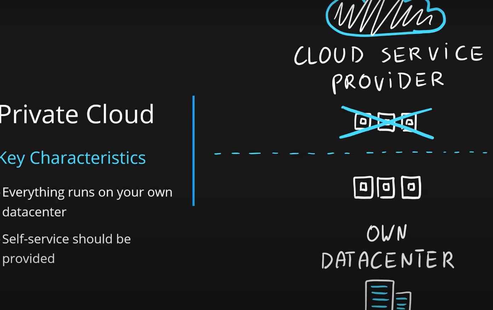
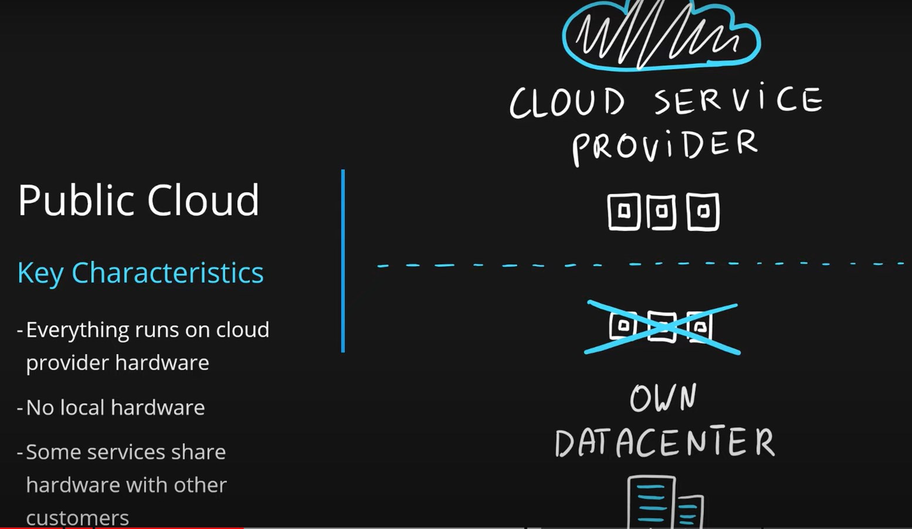
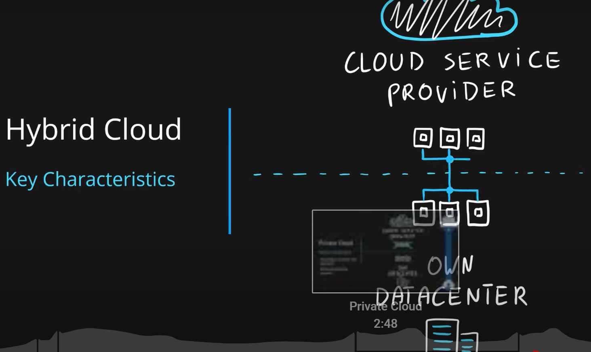

## Private
<pre>
Key Characteristics
  Everything runs on your own datacenter
  Self-service should be provided
  You maintain the hardware

Advantages
  Can support any scenario
  Total control over security and infrastructure
  Can meet any security and compliance policy

Disadvantages
  Initial investment is required (CapEx)
  Limited agility constrained by server capacity and team skills
  Very dependent on IT skills & expertise

</pre>

## Public
<pre>
Key Characteristics
  Everything runs on cloud provider hardware
  No local hardware
  Some services share hardware with other customers

Advantages
  No CapEx (No initial investment)
  High Availability
  Agility
  Pay as you Go (PAYG) pricing
  No hardware maintenance
  No deep technical skills required

Disadvantages
  Not all security and compliance policies can be met
  No ownership over the physical infrastructure
  Rare specific scenarios can’t be done

</pre>

## Hybrid
<pre>
Key Characteristics
  Combines both Public & Private cloud

Advantages
  Great flexibility
  You can run any legacy apps in private cloud
  Can utilize existing infrastructure
  Meet any security& compliance requirements
  Can take advantage of all public cloud benefits

Disadvantages
  Can be more expensive
  Complicated to manage due to larger landscape
  Most dependent on IT skills & expertise from all three models

</pre>
